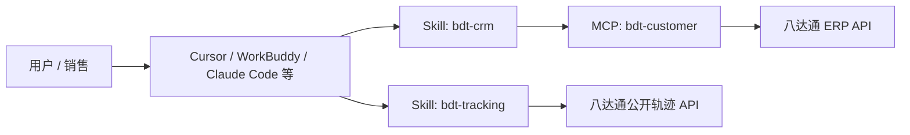
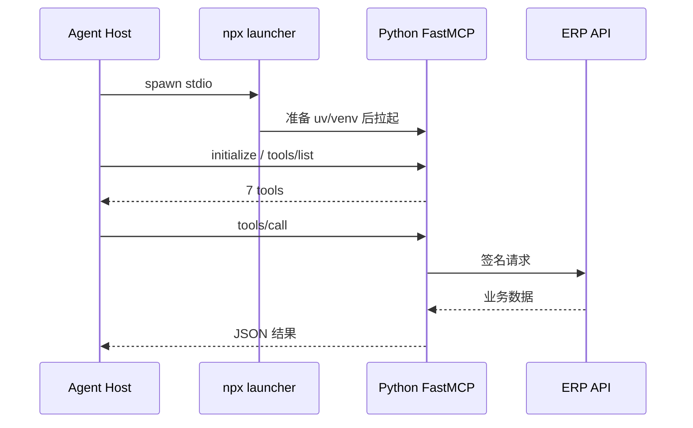
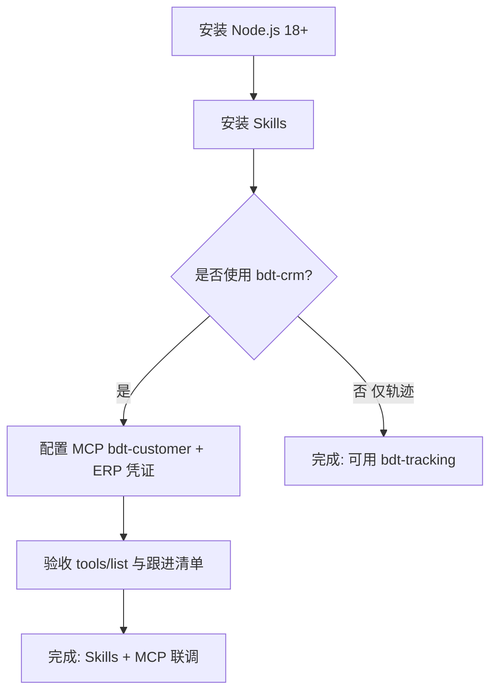

# bdt_silks 安装配置说明（Skills + MCP）

[TOC]

## 1. 文档说明

本文说明如何在 Cursor、WorkBuddy / CodeBuddy 及其他 Agent 平台安装：

| 组件 | 类型 | 分发方式 | 当前可用地址 |
|------|------|----------|--------------|
| Skills | Agent Skill（`SKILL.md`） | GitHub + `npx skills` | https://github.com/ouhaibing5/bdt_silks （Public） |
| MCP | MCP Server（stdio） | npm + `npx` | **当前可用** `@ouhaibing/customer-mcp@0.2.2` |

> 目标组织包名 `@dingjian168/customer-mcp`：代码已指向该 scope，但 npm 组织 `dingjian168` 创建并成功 publish 前仍为 404。过渡期请使用 `@ouhaibing/customer-mcp`。

## 2. 整体关系



说明：

- `bdt-tracking`：可独立使用，不依赖 MCP。
- `bdt-crm`：依赖 MCP `bdt-customer` 的 tools；只装 Skill 不配 MCP 时无法拉客户数据。

## 3. 环境前提

| 依赖 | Skills | MCP |
|------|--------|-----|
| Node.js ≥ 18 | 需要（跑 `npx skills`） | 需要（跑 `npx` 启动器） |
| 可访问 GitHub | 需要 | 不需要 |
| 可访问 npm registry | 不需要 | 需要 |
| Python / uv | 不需要 | 启动器会自动准备（写入用户缓存） |
| ERP 第三方凭证 | `bdt-crm` 间接需要 | 调用工具时需要 |

## 4. 安装 Skills

### 4.1 仓库内 Skills 清单

| Skill | 目录 | 能力 |
|-------|------|------|
| `bdt-tracking` | `skills/bdt-tracking/` | 按单号查八达通轨迹，生成 HTML 报告 |
| `bdt-crm` | `skills/bdt-crm/` | 销售跟进清单 / 单客深挖 / 写跟进（依赖 MCP） |

Skills **不是 npm 包**，通过开源 CLI [`npx skills`](https://github.com/vercel-labs/skills) 从 GitHub 安装。

### 4.2 通用命令（推荐）

```bash
# 查看仓库内可用 Skills
npx skills add ouhaibing5/bdt_silks --list

# 全局安装全部
npx skills add ouhaibing5/bdt_silks -g -y

# 只装某一个
npx skills add ouhaibing5/bdt_silks --skill bdt-crm -g -y
npx skills add ouhaibing5/bdt_silks --skill bdt-tracking -g -y

# 安装到所有已检测 Agent
npx skills add ouhaibing5/bdt_silks --all
```

常用参数：

| 参数 | 含义 |
|------|------|
| `-g` / `--global` | 装到用户目录，全项目可用 |
| `-y` / `--yes` | 跳过确认 |
| `-s` / `--skill` | 指定 skill 名 |
| `-a` / `--agent` | 指定目标平台 |
| `--list` | 只列出不安装 |
| `--all` | 全部 skills × 全部 agents |

### 4.3 按平台安装

| 平台 | 安装命令 | 全局目录（常见） |
|------|----------|------------------|
| Cursor | `npx skills add ouhaibing5/bdt_silks -g -y -a cursor` | `~/.cursor/skills/` 或 `~/.agents/skills/` |
| WorkBuddy / CodeBuddy | `npx skills add ouhaibing5/bdt_silks -g -y -a codebuddy` | `~/.codebuddy/skills/`；部分桌面版另读 `~/.workbuddy/skills/` |
| Claude Code | `npx skills add ouhaibing5/bdt_silks -g -y -a claude-code` | `~/.claude/skills/` |
| GitHub Copilot | `npx skills add ouhaibing5/bdt_silks -g -y -a github-copilot` | `~/.copilot/skills/` |
| Windsurf | `npx skills add ouhaibing5/bdt_silks -g -y -a windsurf` | `~/.codeium/windsurf/skills/` |
| Codex | `npx skills add ouhaibing5/bdt_silks -g -y -a codex` | `~/.codex/skills/` |
| OpenCode | `npx skills add ouhaibing5/bdt_silks -g -y -a opencode` | `~/.config/opencode/skills/` |
| Cline | `npx skills add ouhaibing5/bdt_silks -g -y -a cline` | `~/.agents/skills/` |

多平台一次装：

```bash
npx skills add ouhaibing5/bdt_silks -g -y \
  -a cursor -a codebuddy -a claude-code -a github-copilot
```

### 4.4 WorkBuddy 专项说明

#### 命令安装

```bash
npx skills add ouhaibing5/bdt_silks -g -y -a codebuddy
```

#### 手动安装（内网 / 无法访问 GitHub 时）

```bash
git clone https://github.com/ouhaibing5/bdt_silks.git
mkdir -p ~/.workbuddy/skills ~/.codebuddy/skills

cp -r bdt_silks/skills/bdt-crm ~/.workbuddy/skills/
cp -r bdt_silks/skills/bdt-tracking ~/.workbuddy/skills/
cp -r bdt_silks/skills/bdt-crm ~/.codebuddy/skills/
cp -r bdt_silks/skills/bdt-tracking ~/.codebuddy/skills/
```

#### 界面导入

1. 打开 WorkBuddy **设置 → Skills**
2. 点击 **Import Skill**
3. 选择本地 `skills/bdt-crm` 或 `skills/bdt-tracking` 目录
4. 重启应用或新开对话

也可在对话框粘贴：

```bash
npx skills add ouhaibing5/bdt_silks -g -y
```

### 4.5 本地路径安装（开发调试）

```bash
npx skills add /absolute/path/to/bdt_silks -g -y
npx skills add ./skills --skill bdt-tracking -g -y
```

### 4.6 更新 / 卸载 / 查看

```bash
npx skills list -g
npx skills update -g -y
npx skills remove bdt-crm -g -y
npx skills remove --skill '*' -a codebuddy -y
```

### 4.7 Skills 验收

1. 执行 `npx skills add ouhaibing5/bdt_silks --list` 能看到 `bdt-crm`、`bdt-tracking`
2. 安装后对应平台 skills 目录出现同名文件夹且含 `SKILL.md`
3. 新开对话，用触发语验证：
   - 轨迹：`查八达通轨迹，单号 xxx`
   - CRM：`生成本周跟进清单`（需 MCP 已配置）

## 5. 安装 MCP（bdt-customer）

### 5.1 能力清单

| Tool | 说明 |
|------|------|
| `list_my_customers` | 分页拉私海/成交客户列表 |
| `build_followup_list` | 多维打分跟进清单 |
| `get_customer_by_number` | 按客户编号查摘要 |
| `get_customer_accounts` | 查结算账户 / 余额 |
| `get_customer_overview` | 客户摘要 + 账户 |
| `get_customer_freight_trend` | 货量 / 出库趋势 |
| `save_customer_follow` | 写跟进记录 |

### 5.2 npm 包与版本

| 项 | 值 |
|----|----|
| **当前可安装包名** | `@ouhaibing/customer-mcp` |
| **当前 latest** | `0.2.2` |
| 目标组织包名【待确认发布】 | `@dingjian168/customer-mcp` |
| 启动方式 | Node 启动器 + Python FastMCP（stdio） |

自检：

```bash
npm view @ouhaibing/customer-mcp version
npm view @ouhaibing/customer-mcp dist-tags
npx -y @ouhaibing/customer-mcp@0.2.2 --version
```

### 5.3 Cursor `mcp.json` 配置（推荐）

路径常见为：

- 项目：`.cursor/mcp.json`
- 用户：`~/.cursor/mcp.json`

```json
{
  "mcpServers": {
    "bdt-customer": {
      "command": "npx",
      "args": ["-y", "@ouhaibing/customer-mcp@0.2.2"],
      "env": {
        "BDT_ERP_BASE_URL": "https://erptestdev.8dt.com/supply/",
        "BDT_ERP_SECRET": "your-secret",
        "BDT_ERP_CLIENT_ID": "your-client-id",
        "BDT_ERP_CU_ID": "your-cu-id",
        "BDT_ERP_USER_ID": "your-user-id",
        "BDT_ERP_DC": "your-dc"
      }
    }
  }
}
```

组织包发布成功后，把 `args` 改为：

```json
"args": ["-y", "@dingjian168/customer-mcp@latest"]
```

### 5.4 环境变量

| 变量 | 对应第三方参数 | 必填 | 说明 |
|------|----------------|------|------|
| `BDT_ERP_BASE_URL` | - | 否 | 默认 `https://erptestdev.8dt.com/supply/` |
| `BDT_ERP_SECRET` | secret | 是 | 第三方 secret |
| `BDT_ERP_CLIENT_ID` | thirdClientId | 是 | 客户端 ID |
| `BDT_ERP_CU_ID` | thirdCuId | 是 | 控制单元 |
| `BDT_ERP_USER_ID` | thirdUserId | 是 | 用户 |
| `BDT_ERP_DC` | thirdDc | 是 | 数据中心 |
| `BDT_CUSTOMER_MCP_CACHE` | - | 否 | 覆盖启动器缓存目录，默认 `~/.cache/bdt-customer-mcp` |

说明：

- 缺凭证时服务仍可启动并暴露 tools；真正 `tools/call` 时会返回缺配置错误。
- 凭证建议只放在 MCP Host 的 `env`，不要提交到 Git。

### 5.5 其他平台接入要点

MCP 统一协议为：**Host 拉起命令进程 → stdio JSON-RPC**。

| 平台 | 配置方式 |
|------|----------|
| Cursor | `mcp.json` 的 `mcpServers` |
| Claude Desktop / Claude Code | 对应 MCP servers 配置文件（同样 `command` + `args` + `env`） |
| WorkBuddy / CodeBuddy | 在 MCP / 扩展能力配置中新增 stdio server，命令填 `npx`，参数填 `-y @ouhaibing/customer-mcp@0.2.2`，并配置上表环境变量 |
| 其他支持 MCP 的 Agent | 按各自「自定义 MCP Server」入口填写同等字段 |

通用字段映射：

```text
command = npx
args    = ["-y", "@ouhaibing/customer-mcp@0.2.2"]
env     = BDT_ERP_*
```

### 5.6 本地未发布时的启动

```bash
# 直接跑本地包目录（开发）
npx -y /absolute/path/to/bdt_silks/mcp/bdt-customer

# 或 Python 开发模式
cd mcp/bdt-customer
uv sync --extra dev
uv run bdt-customer-mcp
```

### 5.7 MCP 验收

1. Host 中 MCP 状态为已连接 / running
2. 能看到上述 7 个 tools
3. 调用 `list_my_customers` 或 `get_customer_by_number` 有业务返回（非缺凭证错误）



## 6. 推荐组合安装顺序



一键示例：

```bash
# 1) Skills
npx skills add ouhaibing5/bdt_silks -g -y -a cursor -a codebuddy

# 2) MCP：在 Host 配置 mcp.json / MCP 面板（见 5.3）
# 3) 新开对话验证
```

## 7. 故障排查

| 现象 | 可能原因 | 处理 |
|------|----------|------|
| `npx skills` clone 失败 | 网络 / 曾为私有仓 | 仓库已 Public；检查代理；或改手动拷贝 |
| Skills 装了不生效 | 未新开会话 / 装错 agent | 重启 Agent；确认 `-a` 与平台匹配 |
| WorkBuddy 看不到 skill | 目录不一致 | 同时拷到 `~/.workbuddy/skills` 与 `~/.codebuddy/skills` |
| `npm/npx` 404 | 包名或未发布 | 先用 `@ouhaibing/customer-mcp@0.2.2`；勿用未发布的 `@dingjian168/...` |
| MCP 无工具 | 进程启动失败 / 旧包 | 看 Host MCP 日志；升级到 `0.2.2+` |
| 有工具但调用失败 | 缺 `BDT_ERP_*` | 检查 `mcp.json` 的 `env` 后重启 MCP |
| `python -m venv failed` | 旧启动器依赖本机 venv | 使用 `@ouhaibing/customer-mcp@0.2.2`（会自动装 uv） |

## 8. 维护者发布备忘

### 8.1 Skills

- 保持 `skills/<name>/SKILL.md`，frontmatter 必含 `name`、`description`
- 推送到默认分支 `main` 后，用户 `npx skills add ouhaibing5/bdt_silks` 即可更新

### 8.2 MCP

```bash
cd mcp/bdt-customer
npm view @ouhaibing/customer-mcp version
# 组织 dingjian168 创建完成后：
# 1. package.json name 保持 @dingjian168/customer-mcp
# 2. npm publish --access public
# 3. npm view @dingjian168/customer-mcp version
```

## 9. 相关链接

| 资源 | 链接 |
|------|------|
| GitHub 仓库 | https://github.com/ouhaibing5/bdt_silks |
| Skills CLI | https://github.com/vercel-labs/skills |
| MCP 包（当前） | https://www.npmjs.com/package/@ouhaibing/customer-mcp |
| MCP 详细说明 | [mcp/bdt-customer/README.md](../mcp/bdt-customer/README.md) |
| bdt-crm Skill | [skills/bdt-crm/SKILL.md](../skills/bdt-crm/SKILL.md) |
| bdt-tracking Skill | [skills/bdt-tracking/SKILL.md](../skills/bdt-tracking/SKILL.md) |
| WorkBuddy / CodeBuddy Skills 文档 | https://www.workbuddy.ai/docs/ide/Features/Skills |
